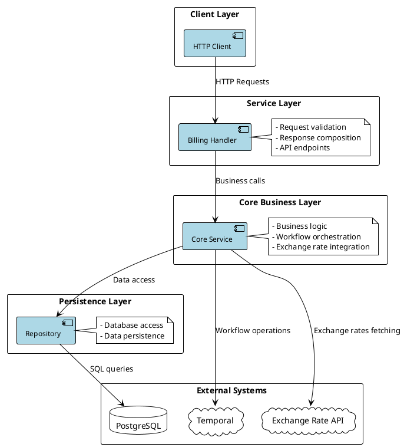
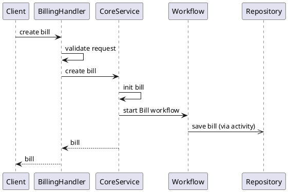
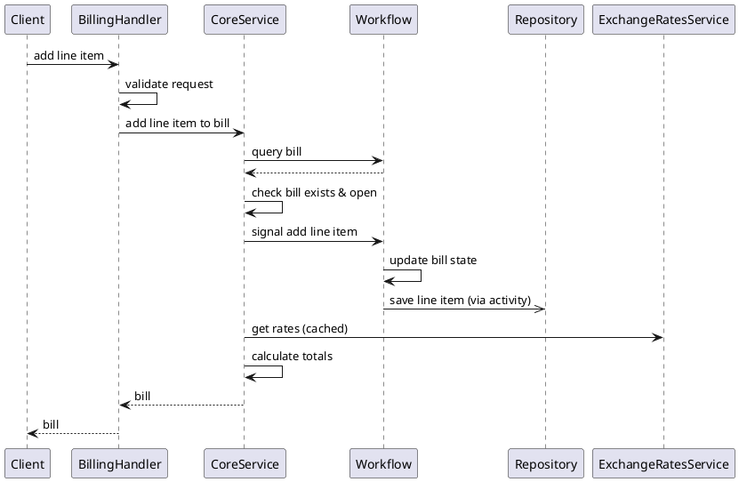
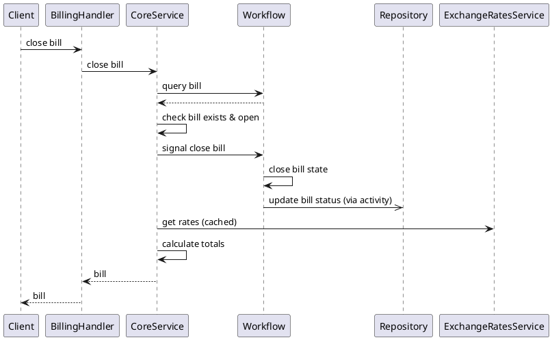
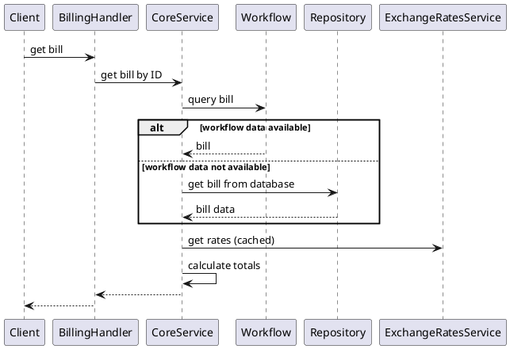

# Pave Coding Challenge - Billing System

## Overview
A billing system built with Encore.dev and Temporal for managing progressive fee accrual and billing workflows.

The Billing API provides the following capabilities:

- **Progressive Fee Accrual**: Add line items to bills throughout a billing period
- **Temporal Workflow Management**: Automated bill lifecycle with workflow-based fee collection
- **Multi-Currency Support**: Supported currencies can be configured
- **RESTful API**: Clean and intuitive REST endpoints for all operations
- **Real-time Signals**: Temporal signals for immediate line item processing
- **Automated Closing**: Bills automatically close at the end of their billing period

The service is also available on Encore cloud at
[https://staging-pave-billing-s2a2.encr.app/bills](https://staging-pave-billing-s2a2.encr.app/bills),
where it runs with Temporal Cloud.

## Features

### [Core Requirements](./challenge.pdf)

### Additional Features
- To handle multi-currency, the service queries Open Exchange Rate service to get the latest exchange rates

## Assumptions & Design Decisions

### Multiple Currencies, Calculate Total at Read
- The bill itself does not have one fixed currency. Instead, it aggregates balances across currencies.
- This I expect to be simpler to implement, and more useful for cross-border settlement.
- The other alternative is to use a single currency, convert to it when adding line items of a different currency.
This would involve the party being billed agree with the exchange rate, and its source, at the time of fee accrual.

### Use of an External Database aside from Temporal
- I expect a traditional database would be useful for a variety of use cases, including direct querying and analytics.
Therefore, aside from the bill record in Temporal, an external database is used to store the bill state.
- While the bill is opened, temporal workflow is the source of truth,
since the close/add line item operation is done asynchronously via signal.
When the workflow state is no longer accessible, the database record is retrieved and used for queries.
- The tradeoff of this approach is increasing complexity due to multiple sources of truth.

### Returning the Bill State Synchronously
- As part of the requirement to use temporal signal, we add line items and close the bill asynchronously.
- However, we would also like to view the line items and total after closing the bill.
- Therefore, I updated the bill immediately after sending the signal successfully to return the updated bill to clients.
This would allow synchronous response to the client, but would risk having the response out of sync with the bill state in the workflow.

## Architecture (component diagrams)

### High-Level Architecture



## Detailed Design

### Code Organization (directory structure)

```
pave-billing/
├── billing/                          # Main service package
│   ├── billing.go                    # HTTP handlers & service initialization
│   ├── validation.go                 # Request validation logic
│   ├── config.cue                    # Configuration schema
│   ├── migrations/                   # Database migrations
│   │   └── 1_create_bills_table.up.sql
│   ├── core/                         # Business logic layer
│   │   ├── service.go                # Core business service
│   │   ├── workflow.go               # Temporal workflows
│   │   ├── activities.go             # Temporal activities
│   │   └── mocks/                    # Generated mocks
│   ├── repository/                   # Data access layer
│   │   ├── repository.go             # Database operations
│   │   └── test_utils.go             # Test utilities
│   ├── ext_services/                 # External service integrations
│   │   ├── exchange_rates.go         # Exchange rate service
│   │   └── mocks/                    # Generated mocks
│   └── models/                       # Data models
│       ├── models.go                 # Core domain models
│       ├── httpmodels.go             # HTTP request/response models
│       ├── configs.go                # Configuration models
│       └── errors.go                 # Error definitions
├── encore.app                        # Encore app configuration
├── go.mod                            # Go module definition
└── README.md                         # Documentation
```

### [API Reference](http://localhost:9400/pave-billing-s2a2/envs/local/api)
#### Create bill
```bash
curl --location 'https://staging-pave-billing-s2a2.encr.app/bills' \
--header 'Content-Type: application/json' \
--data '{
  "customer_id": "hung",
  "period_start": "2025-09-15T15:04:05Z",
  "period_end": "2025-09-30T20:19:05Z"
}'
```

#### Add line item
```bash
curl --location 'https://staging-pave-billing-s2a2.encr.app/bills/:bill_id/line-items' \
--header 'Content-Type: application/json' \
--data '{
  "description": "hung item",
  "quantity": 6,
  "unit_price": 0.6,
  "currency": "GEL"
}'
```

#### Close bill
```bash
curl --location --request POST 'https://staging-pave-billing-s2a2.encr.app/bills/:bill_id/close'
```

#### Get bill
```bash
curl --location 'https://staging-pave-billing-s2a2.encr.app/bills/:bill_id'
```

### Error Responses

All endpoints return structured error responses:

```json
{
  "code": "invalid_argument",
  "message": "quantity must be greater than zero",
  "details": {}
}
```

### [Configuration](./billing/config.cue)

### Create Bill Flow (sequence diagram)



### Add Line Item Flow (sequence diagram)



### Close Bill Flow (sequence diagram)



### Query Bill Flow (sequence diagram)



### Billing Temporal Workflows

The `BillWorkflow` manages the complete lifecycle of a bill:

1. **Initialization**: Create an open bill and setup signal handlers
2. **Signal Processing**: Handle line item additions and close requests by updating the bill state and its corresponding database record
3. **Automatic Closure**: Close the bill when its period ends
4. **State Management**: Maintain bill state

### [Database Schema](./billing/migrations)

## Testing

Unit tests for `core`, `ext_services`, `models`, and `billing handler` have been written.

### Run
```bash
encore test ./...
```

## Run Locally and Deploy

### Run Locally
#### Prerequisites
- [Encore CLI](https://encore.dev/docs/install) installed
- [Temporal](https://temporal.io/) server
- PostgreSQL (managed by Encore)
- Go 1.23+

#### 1. Install Dependencies

```bash
# Install Encore CLI
brew install encoredev/tap/encore

# Install temporal CLI for local development
brew install temporal
```

#### 2. Start Temporal Server

```bash
# Start temporal on default port 7233
temporal server start-dev --db-filename temporal.db
```

#### 3. Set OpenExchangeRatesAppId Secret
The value is sent via email, or you can register for a free account at https://openexchangerates.org/.

```bash
encore secret set --type local OpenExchangeRatesAppId
```

#### 4. Run the Application

```bash
encore run
```

The API will be available at `http://localhost:4000` and the Encore dashboard at `http://localhost:9400`.

### Deploy to Encore cloud

#### 1. Create an Encore Application

#### 2. Configure a Temporal Server

#### 3. Update Secrets
2 secrets are required to run the application on the cloud:
- `OpenExchangeRatesAppId`: Open Exchange Rates API key
- `TemporalApiKey`: Temporal API key

#### 4. Deploy the Application
```bash
git add .
git commit -m "Deploy billing API"
git push encore
```

## Monitoring
- **Encore Dashboard**: `http://localhost:9400` for local development
- **Temporal UI**: `http://localhost:8233` for workflow monitoring
- **Logs**: Available through Encore CLI and dashboard

## Security
- **Input Validation**: All requests are validated
- **SQL Injection Protection**: Parameterized queries
- **Error Handling**: Structured error responses without sensitive data

## Production-ready Improvements
- Refining business logic to fit real-world use cases
- Improve error handling and response
- Authentication: integrate with an actual account management system, including authentication and authorization,
to replace the dummy `customer_id` field when creating bills